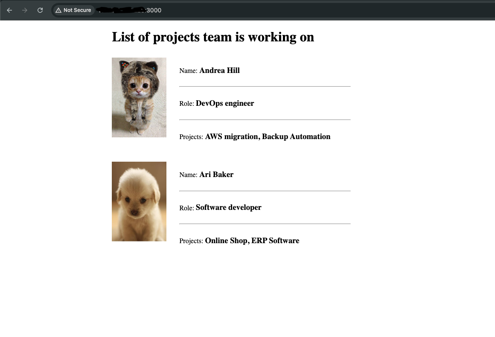

## Host Management using DigitalOcean
```
AS A DevOps Engineer
I WANT to be able to package code
SO I can host this code on a remote server
```

## Example
In the app folder you can find a tar file to unpack and add the app to your local machine

## Module 5 Example Photo


## Module 6 Example Photo
